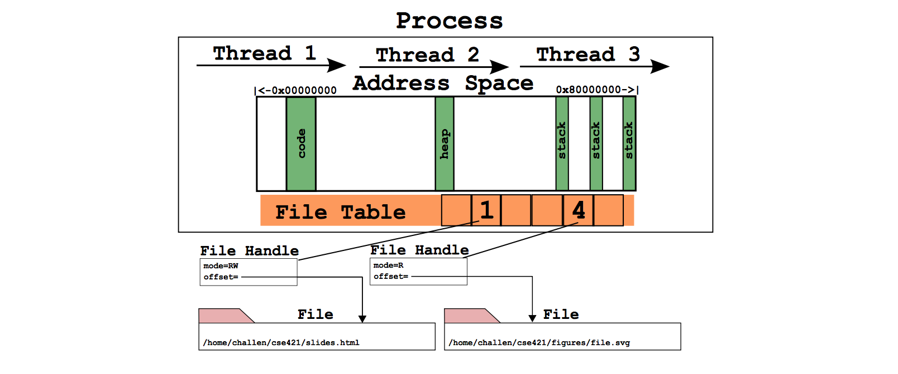

#System calls

##Two parts
1. File system support
-
	1. open 		SYS_open			(45)
	2. read 		SYS_read			(50)
	3. write 		SYS_write			(55)
	4. lseek 		SYS_lseek			(59)
	5. close 		SYS_close			(49)
	6. dup2 		SYS_dup2			(48)
	7. chdir 		SYS_chdir			(74)
	8. __getcwd 	SYS___getcwd		(76)
2. Process support
-	
	1. getpid 		SYS_getpid			(5)
	2. fork 		SYS_fork			(0)
	3. execv 		SYS_execv			(2)
	4. waitpid 		SYS_waitpid			(4)
	5. _exit 		SYS__exit			(3)

##Existing process supoort

 Files which load and run user level programs 

	1. kern/syscall/loadelf.c
		. loads the executable from file system to memory
	2. kern/syscall/runprogram.c
		. responsible for running a program from kernel menu
	3. kern/lib/uio.c
		. funcitons to move data b/w user and kernel space
		
What are the ELF magic numbers?

What is the difference between UIO_USERISPACE and UIO_USERSPACE? When should one use UIO_SYSSPACE instead?

Why can the struct uio that is used to read in a segment be allocated on the stack in load_segment? Or, put another way, where does the memory read actually go?

In runprogram why is it important to call vfs_close before going to user mode?

What function forces the processor to switch into user mode? Is this function machine dependent?

In what files are copyin, copyout, and memmove defined? Why are copyin and copyout necessary? (As opposed to just using memmove.)

What is the purpose of userptr_t?
		
##Traps and System calls

*kern/arch/mips/syscall/syscall.c* handles traps that happen to be system calls

	1.locore/trap.c
		. mips_trap
		. enter_new_process
		. kill_curthread
	2. syscall/syscall.c
		.syscall
		.reboot
		.enter_forked_process

What is the numerical value of the exception code for a MIPS system call?

How many bytes is an instruction in MIPS? Try to answer this by reading syscall carefully, not by looking somewhere else.

Why do you probably want to change the implementation of kill_curthread?

What would be required to implement a system call that took more than 4 arguments?
##Support code for User Programs

What is the purpose of the SYSCALL macro?

What is the MIPS instruction that actually triggers a system call? (Answer this by reading the source in this directory, not looking somewhere else.)

Now that OS/161 supports 64 bit values, lseek takes and returns a 64 bit offset value. Thus, lseek takes a 32 bit file handle (arg0), a 64 bit offset (arg1), a 32 bit whence (arg3), and needs to return a 64 bit offset. In void syscall(struct trapframe *tf) where will you find each of the three arguments (in which registers) and how will you return the 64 bit offset?

## Interrupt handler

	1.Interrupt is triggered
	2.Interrupt handler is run
	3.Handler calls mips_trap()
		. If hardware, call device driver
		. If timer interrupt, call hardlock()
		. If syscall, call syscall handler: syscall()
		. If pagefault, call memory manager: vm_fault()
### Argument passing convention(Userspace to kernel)

	.passing four 32-bit arguments via a0-a3 registers
	.any 64-bit arguments must ne 64-bit aligned
	.remaining arguments fetched from user stack, from sp+16
	
### Returning values(Kernel to userspace)
	On success:
	.Return value goes in the v0 register for 32-bit
	value or v0/v1 if 64-bit
	.a3 set to 0
	
	On failure:
	.Error code sent via v0
	.a3 set to 1
	
## Error List

	0						"Operation succeeded" 

	ENOSYS 					"Function not implemented" 

	unused					"(undefined error 2)"

	ENOMEM					"Out of memory"

	EAGAIN					"Operation would block"

	EWOULDBLOCK				"Operation would block"      
        
	EINTR					"Interrupted system call"

	EFAULT					"Bad memory reference"

	ENAMETOOLONG			"String too long"

	EINVAL 					"Invalid argument"

	EPERM 					"Operation not permitted"

	EACCES 					"Permission denied"

	EMPROC 					"Too many processes"
	(EPROCLIM in Unix) 
	
	 ENPROC					"Too many processes in system"

	ENOEXEC					"File is not executable"

	E2BIG 					"Argument list too long"

	ESRCH					"No such process"

	ECHILD					"No child processes"

	ENOTDIR					"Not a directory"

	EISDIR					"Is a directory"

	ENOENT					"No such file or directory"

	ELOOP					"Too many levels of 
									symbolic links" 

	ENOTEMPTY				"Directory not empty"

	EEXIST					"File or object exists"

	EMLINK					"Too many hard links"

	EXDEV					"Cross-device link"

	ENODEV					"No such device",             

	ENXIO					"Device not available"

	EBUSY					"Device or resource busy"

	EMFILE					"Too many open files"

	ENFILE					"Too many open files in system"

	EBADF					"Bad file number"

	EIOCTL					"Invalid or inappropriate ioctl" 
	(ENOTTY in Unix)

	EIO						"Input/output error"

	ESPIPE					"Illegal seek"

	EPIPE					"Broken pipe"

	EROFS					"Read-only file system"

	ENOSPC					"No space left on device"

	EDQUOT					"Disc quota exceeded"

	EFBIG					"File too large"

	EFTYPE					"Invalid file type or format"

	EDOM					"Argument out of range"

	ERANGE					"Result out of range"

	EILSEQ					"Invalid multibyte 
								character sequence"

	ENOTSOCK				"Not a socket"

	EISSOCK					"Is a socket"
	(EOPNOTSUPP in Unix)

	EISCONN					"Socket is already connected"

	ENOTCONN				"Socket is not connected"

	ESHUTDOWN				"Socket has been shut down"

	EPFNOSUPPORT			"Protocol family not supported"

	ESOCKTNOSUPPORT			"Socket type not supported"

	EPROTONOSUPPORT			"Protocol not supported"

	EPROTOTYPE				"Protocol wrong type for socket"

## Process Structure

### proc.h
~~~
fh{
	unsigned volatile offset;                                                                    
   	unsigned mode;                                                                               
   	unsigned num_refs;                                                                           
   	struct vnode *fileobj;                                                                       
	struct lock *fh_lock; 
}

proc{
char *p_name;    Name of this process 
struct spinlock p_lock;  Lock for this structure                                                                                                                                   
unsigned p_numthreads;     Number of threads in this 
struct addrspace *p_addrspace; Virtual address space
struct vnode *p_cwd; current working directory

struct fh *file_table[64];
int next_fd; 
}

void proc_bootstrap(void); called during sys start for data structure allocation
struct proc *proc_create_runprogram(const char *name); create fresh process using runprogram()
void proc_destroy(struct proc *proc); destroy process
int proc_addthread(struct proc *proc, struct thread *t); attach a thread ro a process
void proc_remthread(struct thread *t); detach a thread from its process
struct addrspace *proc_getas(void); fetch address space of the process
struct addrspace *proc_setas(struct addrspace *); change addressspace of the process and return the old one
~~~

## File subsystem

### fs.h

	struct vnode;
	
	struct fs {
        void *fs_data;
        const struct fs_ops *fs_ops;
	};
	
	struct fs_ops {
        int           (*fsop_sync)(struct fs *);
        const char   *(*fsop_getvolname)(struct fs *);
        int           (*fsop_getroot)(struct fs *,
        				struct vnode **);
        int           (*fsop_unmount)(struct fs *);
    };
    
    void semfs_bootstrap(void);
    
### vnode.h

	struct vnode {
        int vn_refcount;                /* Reference count */
        struct spinlock vn_countlock;   /* Lock for vn_refcount */

        struct fs *vn_fs;               /* Filesystem vnode belongs to */

        void *vn_data;                  /* Filesystem-specific data */

        const struct vnode_ops *vn_ops; /* Functions on this vnode */
	};
	
	struct vnode_ops {
        unsigned long vop_magic;        /* should always be VOP_MAGIC */

        int (*vop_eachopen)(struct vnode *object, int flags_from_open);
        int (*vop_reclaim)(struct vnode *vnode);

        int (*vop_read)(struct vnode *file, struct uio *uio);
        int (*vop_readlink)(struct vnode *link, struct uio *uio);
        int (*vop_getdirentry)(struct vnode *dir, struct uio *uio);
        int (*vop_write)(struct vnode *file, struct uio *uio);
        int (*vop_ioctl)(struct vnode *object, int op, userptr_t data);
        int (*vop_stat)(struct vnode *object, struct stat *statbuf);
        int (*vop_gettype)(struct vnode *object, mode_t *result);
        bool (*vop_isseekable)(struct vnode *object);
        int (*vop_fsync)(struct vnode *object);
        int (*vop_mmap)(struct vnode *file /* add stuff */);
        int (*vop_truncate)(struct vnode *file, off_t len);
        int (*vop_namefile)(struct vnode *file, struct uio *uio);

        int (*vop_creat)(struct vnode *dir,
                         const char *name, bool excl, mode_t mode,
                         struct vnode **result);
        int (*vop_symlink)(struct vnode *dir,
                           const char *contents, const char *name);
        int (*vop_mkdir)(struct vnode *parentdir,
                         const char *name, mode_t mode);
        int (*vop_link)(struct vnode *dir,
                        const char *name, struct vnode *file);
        int (*vop_remove)(struct vnode *dir,
                          const char *name);
        int (*vop_rmdir)(struct vnode *dir,
                         const char *name);

        int (*vop_rename)(struct vnode *vn1, const char *name1,
                          struct vnode *vn2, const char *name2);

        int (*vop_lookup)(struct vnode *dir,
                          char *pathname, struct vnode **result);
        int (*vop_lookparent)(struct vnode *dir,
                              char *pathname, struct vnode **result,
                              char *buf, size_t len);
        };

### vfs.h

	struct uio; 		(kernel/userspce buffer I/O)
	struct device; 		(for deivce)
	struct fs; 			(for file system)
	struct vnode; 		(for on-disk file)
	
	int vfs_setcurdir(struct vnode *dir);
	int vfs_clearcurdir(void);
	int vfs_getcurdir(struct vnode **retdir);
	int vfs_sync(void);
	int vfs_getroot(const char *devname, struct vnode **result);
	const char *vfs_getdevname(struct fs *fs);
	
	
	int vfs_lookup(char *path, struct vnode **result);
	int vfs_lookparent(char *path, struct vnode **result,
						char *buf, size_t buflen);
						
	int vfs_open(char *path, int openflags,
				 mode_t mode, struct vnode **ret);  //////
	void vfs_close(struct vnode *vn);				///////
	int vfs_readlink(char *path, struct uio *data);
	int vfs_symlink(const char *contents, char *path);
	int vfs_mkdir(char *path, mode_t mode);
	int vfs_link(char *oldpath, char *newpath);
	int vfs_remove(char *path);
	int vfs_rmdir(char *path);
	int vfs_rename(char *oldpath, char *newpath);
	
	int vfs_chdir(char *path);
	int vfs_getcwd(struct uio *buf);
	
	void vfs_bootstrap(void);

	int vfs_setbootfs(const char *fsname);
	void vfs_clearbootfs(void);

	int vfs_adddev(const char *devname, 
				struct device *dev, int mountable);
	int vfs_addfs(const char *devname, struct fs *fs);

	int vfs_mount(const char *devname, void *data,
	int (*mountfunc)(void *data,struct device *dev,
                               struct fs **result));
	int vfs_unmount(const char *devname);
	int vfs_swapon(const char *devname, 
					struct vnode **result);
	int vfs_swapoff(const char *devname);
	int vfs_unmountall(void);
	
	void vfs_biglock_acquire(void);
	void vfs_biglock_release(void);
	bool vfs_biglock_do_i_hold(void);
	
### Division:

Haneesh:
	read
	close
	chdir
	
Abhilash:
	lseek
	dup2
	__getcwd